# Flashcard Platform

Flashcard Platform là ứng dụng học bằng thẻ ghi nhớ, sử dụng thuật toán FSRS để lập lịch ôn tập theo khả năng ghi nhớ của từng thẻ. Dự án cung cấp đầy đủ giao diện web/PWA, REST API, đồng bộ nhiều thiết bị, nhập dữ liệu Excel, học ngoại tuyến, lập kế hoạch theo thời gian và dashboard theo dõi tiến độ.

Repository được tổ chức dưới dạng pnpm workspace với TypeScript strict. Web được xây dựng bằng React/Vite; API dùng NestJS/TypeORM; dữ liệu được lưu trong SQL Server; mọi thao tác lập lịch FSRS đi qua package `@flashcard/scheduling`.

## Mục lục

- [Tính năng chính](#tính-năng-chính)
- [Ảnh giao diện](#ảnh-giao-diện)
- [Kiến trúc tổng quan](#kiến-trúc-tổng-quan)
- [Yêu cầu hệ thống](#yêu-cầu-hệ-thống)
- [Bắt đầu nhanh trên Windows](#bắt-đầu-nhanh-trên-windows)
- [Cài đặt thủ công](#cài-đặt-thủ-công)
- [Biến môi trường](#biến-môi-trường)
- [Luồng sử dụng](#luồng-sử-dụng)
- [Nhập thẻ từ Excel](#nhập-thẻ-từ-excel)
- [Đọc nội dung thẻ](#đọc-nội-dung-thẻ)
- [Offline và đồng bộ](#offline-và-đồng-bộ)
- [API chính](#api-chính)
- [Lệnh phát triển](#lệnh-phát-triển)
- [Kiểm thử và CI](#kiểm-thử-và-ci)
- [Migration và dữ liệu](#migration-và-dữ-liệu)
- [Bảo mật](#bảo-mật)
- [Xử lý sự cố](#xử-lý-sự-cố)
- [Tài liệu liên quan](#tài-liệu-liên-quan)

## Tính năng chính

### Tài khoản và phiên đăng nhập

- Đăng ký, đăng nhập, làm mới access token và đăng xuất.
- Refresh token được lưu trong cookie HttpOnly và được xoay vòng.
- Có thể đăng xuất thiết bị hiện tại hoặc đăng xuất tất cả thiết bị.
- Phiên đăng nhập được khôi phục khi tải lại trang; web tự thử làm mới token khi access token hết hạn.

### Bộ thẻ và nội dung học

- Tạo, sửa, tìm kiếm, lọc và xóa mềm bộ thẻ.
- Tạo, sửa, tìm kiếm và xóa mềm note/thẻ học.
- Hỗ trợ `Basic`, `BasicAndReverse` và `Cloze`.
- Mỗi bộ thẻ có thể cấu hình desired retention, độ ưu tiên, giới hạn thẻ mới mỗi ngày, trạng thái cốt lõi và trạng thái lưu trữ.
- Nội dung thẻ hỗ trợ Unicode đầy đủ, bao gồm tiếng Việt có dấu và ký hiệu phiên âm.
- Với mặt sau dạng `cụm từ — ví dụ`, dấu `—` hoặc `–` và phần ví dụ được tự động đưa xuống dòng khi hiển thị; dữ liệu gốc không bị sửa.

### Nhập Excel và sao lưu dữ liệu

- Nhập tệp `.xlsx` có nhiều worksheet và nhiều bảng trong cùng một worksheet.
- Tự nhận diện cột `Front`/`Back`, các alias tiếng Việt/tiếng Anh và nhiều bố cục từ vựng chuyên biệt.
- Xem trước dữ liệu trước khi nhập, báo dòng không hợp lệ và bỏ qua cột không liên quan.
- Tối đa 10.000 dòng được quét trong một lần nhập; mỗi tệp Excel tối đa 5 MiB.
- Phát hiện nội dung trùng trong cùng bộ thẻ và cập nhật note phù hợp thay vì tạo bản sao.
- Hoàn tác lần import gần nhất của từng bộ thẻ.
- Xuất toàn bộ snapshot học tập ra JSON và nhập lại theo cơ chế merge/idempotent; tệp nhập snapshot tối đa 50 MiB.

### Ôn tập bằng FSRS

- Lập lịch bằng `ts-fsrs` thông qua package `@flashcard/scheduling`.
- Bốn mức đánh giá: `Again`, `Hard`, `Good`, `Easy`.
- Xem trước lịch ôn tiếp theo trước khi chấm.
- Hỗ trợ phím tắt, thao tác chạm/vuốt và giao diện responsive.
- Có thể hoàn tác lượt chấm gần nhất bằng event bù; lịch sử cũ không bị sửa hoặc xóa.
- Phiên học có thể chạy toàn màn hình, tạm dừng, thay đổi cỡ chữ và chiều rộng thẻ.
- Phiên giới hạn thời gian ưu tiên thẻ đến hạn, thẻ yếu/leech và thẻ mới theo ngân sách học trong ngày.
- Phiên đang học được lưu cục bộ để tiếp tục sau khi đổi trang hoặc tải lại ứng dụng.

### Lướt lại thẻ trong ngày

- Lướt riêng thẻ mới hoặc toàn bộ thẻ đã gặp trong ngày.
- Tự động chuyển giữa mặt trước và mặt sau, có thể tạm dừng, đổi tốc độ, xáo trộn hoặc chuyển thẻ thủ công.
- Hiển thị thời gian ước tính còn lại của phiên.
- Dữ liệu lướt được cache theo người dùng/ngày/múi giờ để tiếp tục khi offline.
- Luồng này chỉ dùng để xem lại, không chấm FSRS và không tạo `ReviewLog`.

### Âm thanh đọc thẻ

- Dùng Web Speech API có sẵn trong trình duyệt, không cần API key bên ngoài.
- Đọc được mặt trước tiếng Việt bằng locale `vi-VN` và tự chọn giọng Việt có sẵn trên thiết bị.
- Hỗ trợ tiếng Anh Mỹ, tiếng Anh Anh và một số ngôn ngữ phổ biến khác.
- Có nút loa riêng trên từng mặt thẻ, chế độ tự đọc, chọn giọng và tốc độ từ `0,5×` đến `2×`.
- Nội dung tiếng Anh ở mặt sau được lọc khỏi phần nghĩa/dịch tiếng Việt để phát âm tự nhiên hơn.
- Khi chuyển mặt hoặc chuyển thẻ, câu đang đọc được hủy trước khi phát câu mới.

### Kế hoạch học tập và dự báo

- Gom nhiều bộ thẻ vào một mục tiêu học tập.
- Đặt ngày đích, múi giờ, số phút học mỗi ngày và giới hạn thẻ mới.
- Có thể ghi đè thời gian học cho từng ngày trong khoảng 1–720 phút.
- Dự báo P50/P80/P90 bằng mô phỏng Monte Carlo dựa trên trạng thái FSRS và lịch khả dụng.
- Tạo kế hoạch hằng ngày theo ngân sách thời gian thực tế.
- Hỗ trợ tiếp tục phiên học đang dang dở thay vì tạo phiên mới.

### Dashboard và phân tích điểm yếu

- Tổng hợp thẻ đến hạn, khối lượng học, thời gian ước tính, thời gian đã học và backlog.
- Biểu đồ hoạt động 14 ngày, retention, tỷ lệ `Again`, số ngày có học và trạng thái đồng bộ.
- Phân tích theo bộ thẻ và nhãn: leech, độ ổn định, thời gian trả lời, xu hướng xấu đi và tỷ trọng thẻ mới.
- Đưa ra khuyến nghị có số liệu để ưu tiên nhóm nội dung cần xử lý.

### Pomodoro

- Các pha tập trung, nghỉ ngắn và nghỉ dài; mặc định 25/5/15 phút.
- Tùy chỉnh mỗi pha từ 1 đến 120 phút.
- Tự chuyển sang nghỉ dài sau mỗi bốn phiên tập trung.
- Đồng hồ chạy theo thời gian thực và tiếp tục đúng khi đổi trang.
- Có âm tick, âm báo hết chu kỳ và công tắc âm thanh lưu trên thiết bị.

### PWA, offline và đồng bộ

- Cài đặt như PWA trên trình duyệt hỗ trợ.
- App shell được precache bằng service worker.
- Hàng đợi ôn tập, note đã mở, mục tiêu và kế hoạch gần nhất được lưu trong IndexedDB.
- Lượt chấm offline được xếp hàng và đẩy lên API khi có mạng trở lại.
- Media đã tải được cache theo tài khoản để dùng trong phiên offline.
- Socket.IO chỉ báo hiệu có thay đổi; dữ liệu chuẩn vẫn được kéo qua REST theo cursor.

## Ảnh giao diện

### Đăng nhập và đăng ký

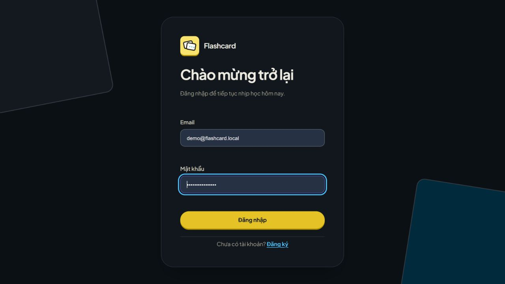

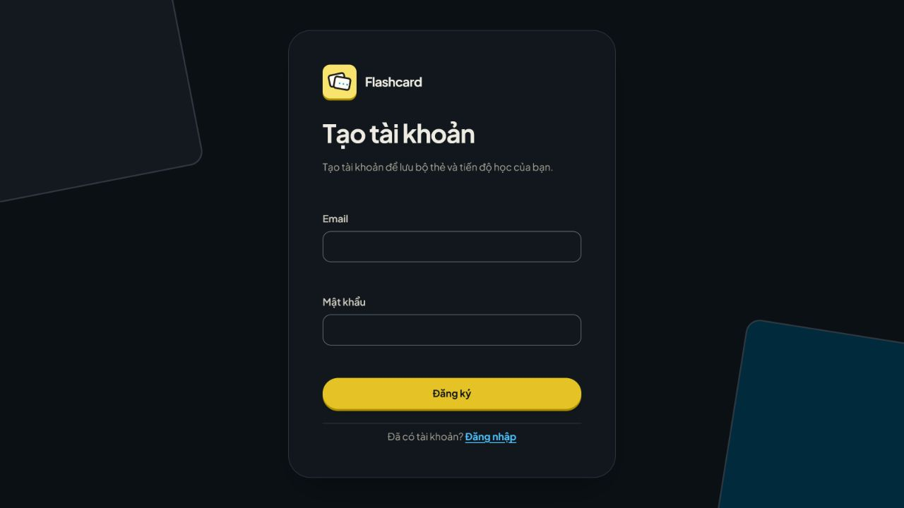

### Tổng quan và tài khoản

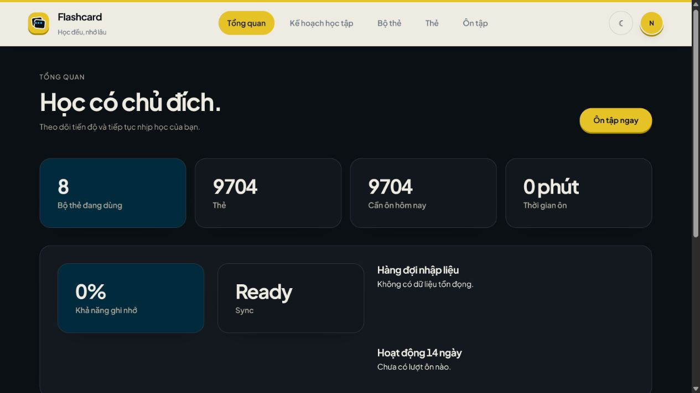

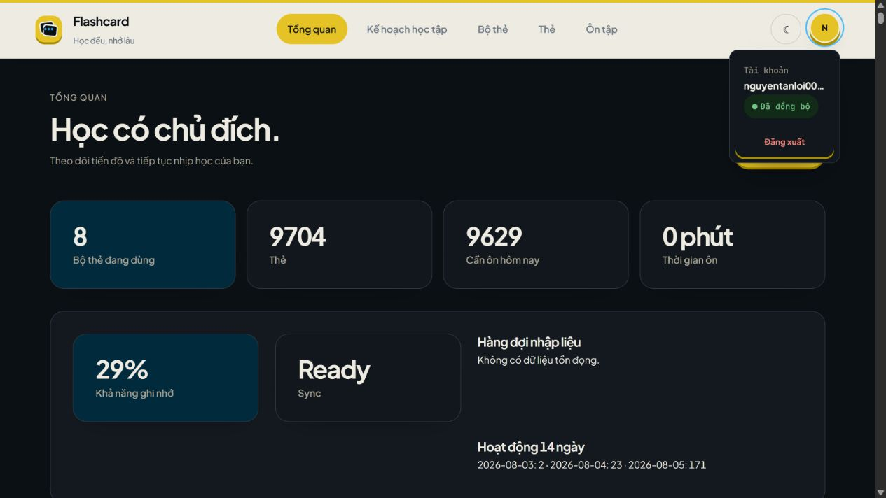

### Kế hoạch và ôn tập

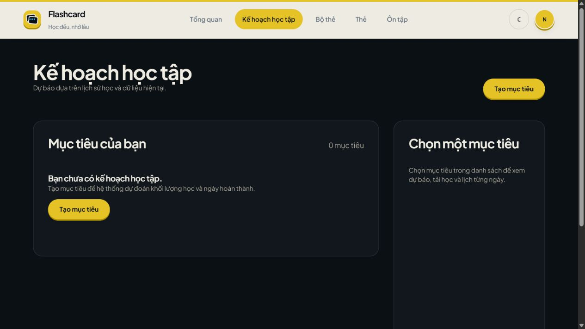

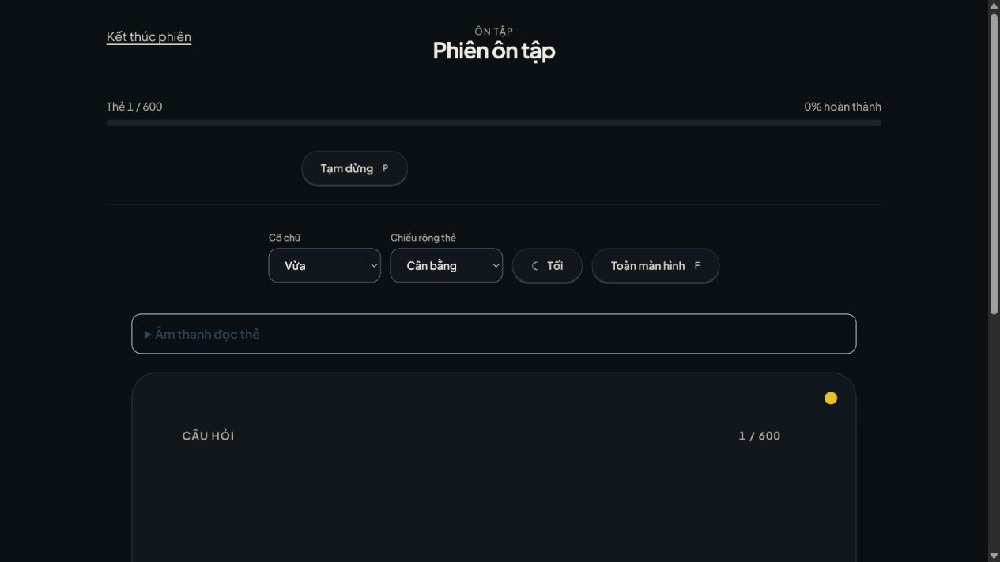

### Bộ thẻ và thẻ học

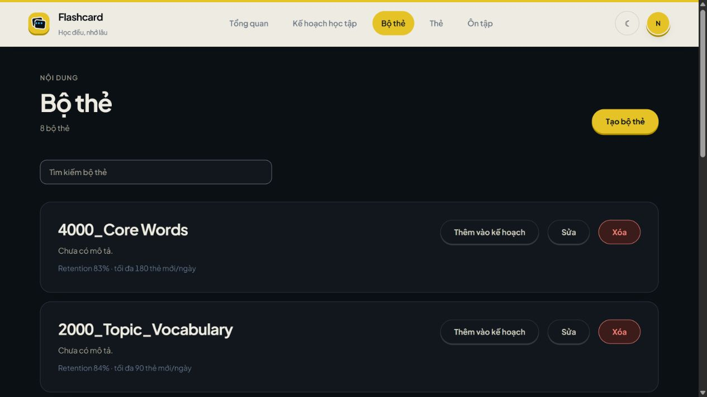

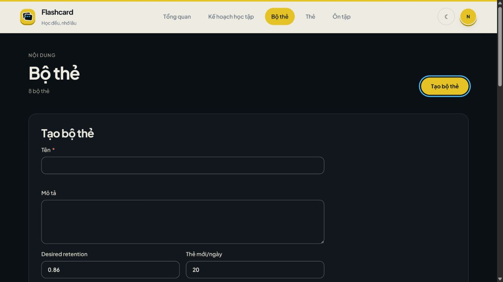

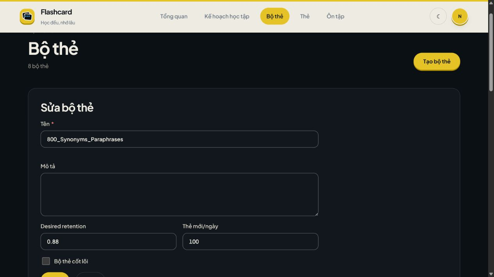

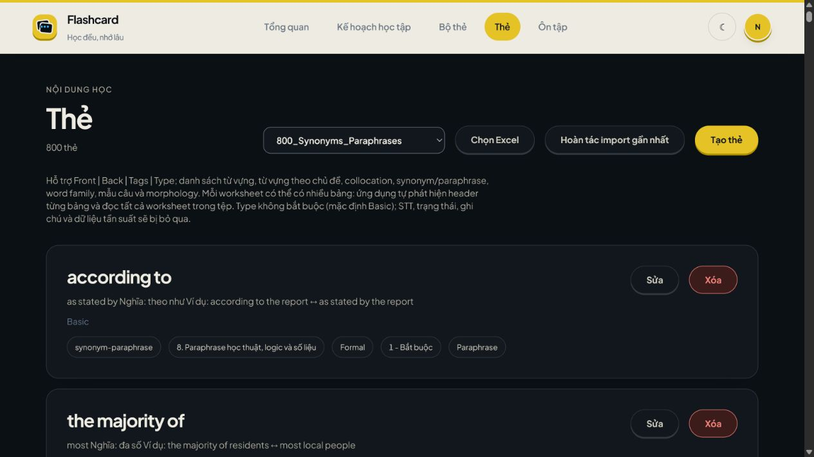

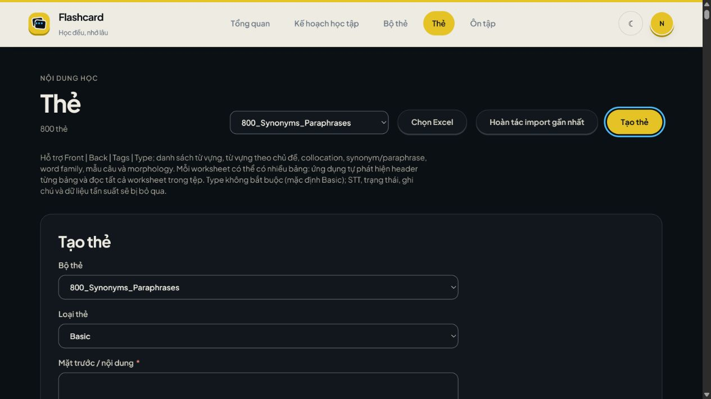

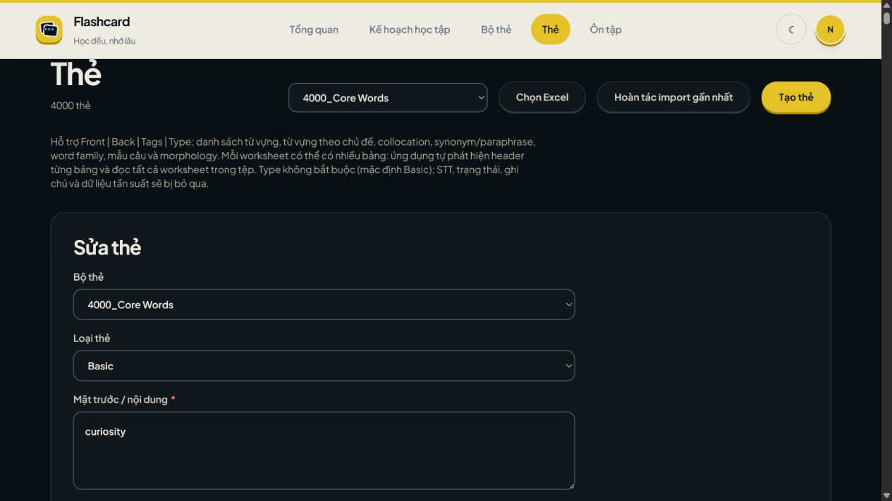

## Kiến trúc tổng quan

Flashcard Platform là modular monolith TypeScript. API là nguồn dữ liệu chuẩn; web chịu trách nhiệm trải nghiệm PWA, cache cục bộ và hàng đợi thao tác offline.

```text
Trình duyệt React/PWA
  ├─ REST API + Bearer access token
  ├─ Refresh token qua cookie HttpOnly
  ├─ Socket.IO: chỉ nhận tín hiệu sync.required
  ├─ IndexedDB/Dexie: cache và hàng đợi offline
  └─ Service worker: precache app shell
                 │
                 ▼
NestJS API
  ├─ Auth và ownership theo user
  ├─ Cards, review, dashboard, study goals, media
  ├─ Sync cursor + append-only ReviewLog
  ├─ TypeORM migration
  └─ @flashcard/scheduling → ts-fsrs
                 │
                 ▼
SQL Server 2022
```

### Cấu trúc repository

```text
flashcard/
├── apps/
│   ├── api/                     # NestJS API, TypeORM migration, Socket.IO
│   └── web/                     # React, Vite, PWA, IndexedDB và Playwright
├── packages/
│   ├── contracts/               # Schema Zod và kiểu dữ liệu dùng chung
│   ├── scheduling/              # Vị trí duy nhất được phép gọi ts-fsrs
│   └── shared/                  # Utility thực sự dùng bởi nhiều package
├── docs/                        # Kiến trúc, domain, API, sync, bảo mật, ADR
├── scripts/
│   └── ensure-local-database.ps1
├── .github/workflows/ci.yml
├── docker-compose.yml           # SQL Server local
├── run-web.bat                  # Launcher nhanh cho Windows
├── pnpm-workspace.yaml
└── package.json
```

### Nguyên tắc dữ liệu quan trọng

- UUID được dùng cho các entity cần đồng bộ.
- Timestamp được lưu theo UTC; múi giờ chỉ được áp dụng ở biên nghiệp vụ/giao diện.
- Resource luôn được giới hạn theo người dùng đã xác thực.
- `ReviewLog` là append-only. Undo tạo event bù, không cập nhật/xóa log cũ.
- Đồng bộ dựa trên cursor `SyncEvent.sequence`.
- Socket.IO không mang dữ liệu nghiệp vụ và không thay thế REST pull.
- Migration chỉ được thêm mới; production không dùng `synchronize: true`.
- `packages/contracts` không chứa ORM entity.
- Toàn bộ lời gọi `ts-fsrs` nằm trong `packages/scheduling`.

### Công nghệ

| Thành phần       | Công nghệ                                                                |
| ---------------- | ------------------------------------------------------------------------ |
| Web              | React 19, Vite 7, React Router, TanStack Query, Zustand, Dexie, Vite PWA |
| API              | NestJS 11, TypeORM, Socket.IO, Swagger                                   |
| Database         | SQL Server 2022                                                          |
| Lập lịch         | `ts-fsrs` qua `@flashcard/scheduling`                                    |
| Xác thực         | JWT access token, refresh token HttpOnly, Argon2id                       |
| Hợp đồng dữ liệu | Zod, TypeScript strict                                                   |
| Kiểm thử         | Vitest, Supertest, Playwright                                            |
| Công cụ          | pnpm workspace, ESLint, Prettier, Docker Compose                         |

## Yêu cầu hệ thống

- Node.js 22 trở lên.
- pnpm 11.9.0.
- Docker Desktop nếu chạy SQL Server bằng Docker Compose; hoặc một SQL Server có thể truy cập từ máy local.
- PowerShell để dùng script chuẩn bị database trên Windows.
- Trình duyệt Chromium/Firefox/Safari hiện đại; Chromium thường có hỗ trợ Web Speech và PWA đầy đủ nhất.

Có thể bật pnpm đúng phiên bản bằng Corepack:

```bash
corepack enable
corepack prepare pnpm@11.9.0 --activate
```

## Bắt đầu nhanh trên Windows

### 1. Cài dependency

```powershell
pnpm install
```

### 2. Tạo `.env`

```powershell
Copy-Item .env.example .env
```

Đổi ít nhất `DB_PASSWORD` và `JWT_ACCESS_SECRET`. `JWT_ACCESS_SECRET` phải dài tối thiểu 32 ký tự. Không commit `.env`.

### 3. Chạy launcher

```powershell
.\run-web.bat
```

Launcher thực hiện tuần tự:

1. Tìm pnpm.
2. Khởi động SQL Server bằng Docker nếu Docker khả dụng.
3. Chờ SQL Server sẵn sàng.
4. Tạo database `DB_NAME`; nếu `DB_USER` khác `sa`, tạo/cập nhật SQL login và cấp quyền trên database.
5. Chạy TypeORM migration.
6. Build và khởi động API nếu cổng 3000 chưa có tiến trình.
7. Khởi động Vite dev server nếu cổng 5556 chưa có tiến trình.
8. Mở trình duyệt tại `http://localhost:5556`.

## Cài đặt thủ công

### 1. Cài dependency và cấu hình

```bash
pnpm install
cp .env.example .env
```

Trên PowerShell dùng `Copy-Item .env.example .env`.

### 2. Khởi động SQL Server

```bash
docker compose up -d sqlserver
docker compose ps
```

Docker Compose chỉ khởi động SQL Server. Database đích vẫn phải tồn tại trước khi chạy migration.

Trên Windows, dùng script có sẵn để đọc `.env`, chờ SQL Server và tạo database/login:

```powershell
powershell -NoProfile -ExecutionPolicy Bypass -File .\scripts\ensure-local-database.ps1
```

Trên macOS/Linux, tạo database `DB_NAME` và SQL login tương ứng bằng công cụ quản trị SQL Server hoặc `sqlcmd` trước khi tiếp tục.

### 3. Chạy migration

```bash
pnpm --filter @flashcard/api migration:run
```

### 4. Chạy API và web

Mở hai terminal tại thư mục gốc:

```bash
# Terminal 1
pnpm --filter @flashcard/api start:dev

# Terminal 2
pnpm --filter @flashcard/web dev
```

### 5. Kiểm tra dịch vụ

| Dịch vụ    | URL                                      |
| ---------- | ---------------------------------------- |
| Web/PWA    | `http://localhost:5556`                  |
| REST API   | `http://localhost:3000/api`              |
| Swagger UI | `http://localhost:3000/api/docs`         |
| Liveness   | `http://localhost:3000/api/health/live`  |
| Readiness  | `http://localhost:3000/api/health/ready` |

### 6. Tạo dữ liệu demo (tùy chọn)

```bash
pnpm --filter @flashcard/api seed:demo
```

Mặc định:

- Email: `demo@flashcard.local`
- Mật khẩu: `DemoPassword123!`

Có thể đặt `SEED_DEMO_EMAIL` và `SEED_DEMO_PASSWORD` trước khi chạy seed. Seed bị chặn trong môi trường production.

## Biến môi trường

API đọc `.env` ở thư mục gốc.

| Biến                             | Bắt buộc       | Mặc định/mục đích                                               |
| -------------------------------- | -------------- | --------------------------------------------------------------- |
| `NODE_ENV`                       | Không          | `development`, `test` hoặc `production`; mặc định `development` |
| `API_PORT`                       | Không          | Cổng API; mặc định `3000`                                       |
| `WEB_ORIGIN`                     | Không          | Origin được CORS cho phép; mặc định `http://localhost:5556`     |
| `DB_HOST`                        | Có             | Host SQL Server                                                 |
| `DB_PORT`                        | Không          | Cổng SQL Server; mặc định `1433`                                |
| `DB_NAME`                        | Có             | Tên database                                                    |
| `DB_USER`                        | Có             | SQL login dùng bởi API                                          |
| `DB_PASSWORD`                    | Có             | Mật khẩu SQL Server                                             |
| `JWT_ACCESS_SECRET`              | Có             | Secret ký JWT, tối thiểu 32 ký tự                               |
| `JWT_ACCESS_TTL`                 | Không          | Thời hạn access token; mặc định `15m`                           |
| `REFRESH_TOKEN_TTL_DAYS`         | Không          | Thời hạn refresh session; mặc định 30 ngày                      |
| `MEDIA_DRIVER`                   | Không          | `local` hoặc `s3`; mặc định `local`                             |
| `MEDIA_LOCAL_PATH`               | Khi dùng local | Thư mục media; mặc định `./storage/media`                       |
| `S3_ENDPOINT`                    | Khi cần        | Endpoint dịch vụ tương thích S3                                 |
| `S3_REGION`                      | Khi dùng S3    | Region; mặc định `us-east-1`                                    |
| `S3_BUCKET`                      | Khi dùng S3    | Tên bucket                                                      |
| `S3_ACCESS_KEY`                  | Khi dùng S3    | Access key                                                      |
| `S3_SECRET_KEY`                  | Khi dùng S3    | Secret key                                                      |
| `S3_FORCE_PATH_STYLE`            | Không          | Path-style URL; mặc định `true`                                 |
| `FORECAST_MONTE_CARLO_RUNS`      | Không          | Số vòng mô phỏng, 1–1.000; mặc định 300                         |
| `FORECAST_MAX_CARDS`             | Không          | Số thẻ tối đa cho một forecast; mặc định 20.000                 |
| `FORECAST_PROJECTION_CARD_LIMIT` | Không          | Số thẻ mẫu cho projection; mặc định 1.200                       |
| `FORECAST_MAX_DAYS`              | Không          | Chân trời dự báo, 30–730 ngày; mặc định 730                     |
| `FORECAST_TIMEOUT_MS`            | Không          | Deadline forecast, 1.000–120.000 ms; mặc định 15.000 ms         |

Web dùng `VITE_API_URL` nếu API không nằm tại `http://localhost:3000/api`. Biến Vite phải có sẵn tại thời điểm chạy/build web.

## Luồng sử dụng

### Học bằng bộ thẻ

1. Đăng ký hoặc đăng nhập.
2. Tạo một bộ thẻ và cấu hình desired retention/giới hạn thẻ mới.
3. Tạo thẻ thủ công hoặc nhập từ Excel.
4. Mở **Ôn tập**, thử nhớ đáp án rồi lật thẻ.
5. Chọn `Again`, `Hard`, `Good` hoặc `Easy`.
6. Theo dõi thẻ đến hạn, backlog và retention trên dashboard.

### Học theo mục tiêu thời gian

1. Mở **Kế hoạch học tập**.
2. Tạo mục tiêu, chọn các bộ thẻ, ngày đích và múi giờ.
3. Đặt số phút học mặc định hoặc ghi đè thời gian của ngày hiện tại.
4. Chạy forecast để xem P50/P80/P90 và lịch dự kiến.
5. Tạo Daily Plan và bắt đầu phiên học giới hạn thời gian.
6. Nếu rời trang, quay lại để tiếp tục snapshot phiên đang dang dở.

### Lướt lại và Pomodoro

- Mở **Lướt lại hôm nay** để xem thẻ mới hoặc mọi thẻ đã gặp trong ngày mà không tác động FSRS.
- Mở **Pomodoro** để chạy chu kỳ tập trung/nghỉ độc lập với phiên ôn tập.

## Nhập thẻ từ Excel

### Giới hạn

- Chỉ nhận `.xlsx`.
- Dung lượng tối đa 5 MiB.
- Quét tối đa 10.000 dòng dữ liệu trên toàn workbook.
- Nội dung `Front` hoặc `Back` tối đa 10.000 ký tự mỗi trường.
- Có thể có nhiều worksheet và nhiều bảng, miễn mỗi bảng có một hàng tiêu đề được nhận diện.

### Bố cục chuẩn `Front`/`Back`

Ví dụ tối thiểu:

| Front                                  | Back                                                                                                  |
| -------------------------------------- | ----------------------------------------------------------------------------------------------------- |
| là nguyên nhân chính gây ra một vấn đề | be a major contributing factor — Social inequality can be a major contributing factor to urban crime. |

Sau khi nhập, mặt sau được hiển thị:

```text
be a major contributing factor
— Social inequality can be a major contributing factor to urban crime.
```

Dấu xuống dòng chỉ được áp dụng khi hiển thị; nội dung lưu trong database vẫn giữ nguyên.

### Alias tiêu đề được nhận diện

Tên cột không phân biệt hoa/thường, dấu tiếng Việt, khoảng trắng, gạch nối và gạch dưới.

| Trường    | Alias tiêu biểu                                                                                                                                                       |
| --------- | --------------------------------------------------------------------------------------------------------------------------------------------------------------------- |
| Mặt trước | `Front`, `Mặt trước`, `Câu hỏi`, `Nội dung`, `Question`, `Prompt`, `Question Text`, `Front Text`, `Flashcard Front`, `Term`, `Word`, `Thuật ngữ`, `Khái niệm`         |
| Mặt sau   | `Back`, `Mặt sau`, `Đáp án`, `Answer`, `Definition`, `Explanation`, `Translation`, `Response`, `Answer Text`, `Back Text`, `Flashcard Back`, `Lời giải`, `Giải thích` |
| Nhãn      | `Tags`, `Tag`, `Nhãn`                                                                                                                                                 |
| Loại thẻ  | `Type`, `Card Type`, `Loại thẻ`                                                                                                                                       |

`Tags` chứa nhiều nhãn phân cách bằng dấu phẩy. `Type` chấp nhận `Basic`, `BasicAndReverse`/`Basic và đảo chiều`, `Reverse` hoặc `Cloze`; nếu để trống thì dùng `Basic`.

### Bố cục chuyên biệt

Importer còn nhận diện các bảng có những nhóm cột sau:

- Phrasal verb + nghĩa tiếng Việt + paraphrase/ví dụ.
- Linking expression + nghĩa/cách dùng/ví dụ.
- Academic/general verb + nghĩa/collocations/ví dụ.
- Vocabulary + nghĩa/phiên âm/loại từ/ví dụ.
- Topic vocabulary + chủ đề Anh/Việt + nghĩa/ví dụ.
- Collocation + headword/cấu trúc/nghĩa/ví dụ.
- Synonym/paraphrase + nghĩa/ví dụ.
- Word family + nghĩa/ví dụ.
- Sentence pattern + mục đích/cách dùng/ví dụ/lỗi cần tránh.
- Morphology/word formation + nghĩa và các dạng từ.

Các cột quản trị như STT, trạng thái, ghi chú hoặc tần suất không thuộc nội dung thẻ sẽ được bỏ qua. Các trường hữu ích được ghép thành mặt sau bằng từng đoạn, giúp nội dung dễ đọc khi ôn tập.

### Quy tắc trùng và hoàn tác

- Duplicate được xác định theo nội dung `Front` + `Back` đã chuẩn hóa trong cùng bộ thẻ.
- Nếu đã có note phù hợp, importer cập nhật note đó và giữ lịch/card liên quan thay vì tạo note trùng.
- Mỗi lần import tạo một batch chứa đủ dữ liệu để hoàn tác các note mới và khôi phục note đã cập nhật.
- Chỉ lần import gần nhất chưa hoàn tác của bộ thẻ được hoàn tác.

### Các bước thao tác

1. Tạo hoặc chọn bộ thẻ đích.
2. Mở trang **Thẻ** và chọn đúng bộ thẻ.
3. Mở **Nhập từ Excel** rồi chọn tệp.
4. Kiểm tra số dòng hợp lệ, dòng lỗi và bản xem trước.
5. Chọn **Xác nhận import**.
6. Nếu cần, chọn **Hoàn tác import gần nhất**.

## Đọc nội dung thẻ

Phần **Âm thanh đọc thẻ** sử dụng `window.speechSynthesis` của trình duyệt.

### Mặt trước

- Nếu phát hiện tiếng Việt, nội dung được giữ nguyên và phát bằng locale `vi-VN`.
- Trình đọc ưu tiên voice tiếng Việt có sẵn trên thiết bị.
- Nội dung tiếng Việt không dấu phổ biến cũng được nhận diện bằng danh sách từ thực dụng.
- Nếu không phải tiếng Việt, locale/voice đang chọn trong cài đặt được sử dụng.

### Mặt sau

- Bỏ metadata media và trường phiên âm riêng khi đang đọc nội dung thường.
- Không đọc lặp các trường trùng nhau.
- Với nội dung trộn Việt–Anh, ưu tiên phần ví dụ/paraphrase tiếng Anh và bỏ phần dịch sau `—`/`–`.
- Dấu câu và ký hiệu trang trí được loại trước khi phát, nhưng dấu nháy trong từ tiếng Anh được giữ khi cần.

### Giới hạn

- Chất lượng giọng phụ thuộc trình duyệt, hệ điều hành và voice đã cài.
- Trình duyệt có thể chặn phát âm tự động trước tương tác đầu tiên của người dùng.
- Bộ nhận diện ngôn ngữ là heuristic phục vụ nội dung thẻ, không phải mô hình phát hiện ngôn ngữ tổng quát.
- Không có request TTS gửi tới dịch vụ bên ngoài từ ứng dụng.

## Offline và đồng bộ

### Dữ liệu cục bộ

Web dùng Dexie/IndexedDB để lưu:

- Hàng đợi ôn tập và note đã tải.
- Lượt chấm đang chờ đồng bộ.
- Cursor đồng bộ và conflict cục bộ.
- Study goal, forecast, daily plan gần nhất.
- Snapshot phiên học giới hạn thời gian.
- Dữ liệu lướt thẻ trong ngày.
- Media cache được phân vùng theo tài khoản.

### Quy trình đồng bộ

1. Mỗi thiết bị có một UUID ổn định.
2. Mỗi lượt chấm có `clientEventId` để API xử lý idempotent.
3. Khi offline, event được lưu vào hàng đợi cục bộ.
4. Khi online, một tab giành quyền đẩy hàng đợi bằng Web Locks API hoặc lease trong `localStorage`.
5. API ghi dữ liệu và tạo `SyncEvent` có sequence tăng dần.
6. Client pull theo cursor để nhận thay đổi còn thiếu.
7. Socket.IO chỉ gửi `sync.required` để client biết cần pull sớm hơn.

Nếu version card xung đột, client giữ conflict cục bộ và kéo trạng thái mới từ server; không ghi đè mù lịch sử ôn tập.

### Service worker

- Precache HTML, JavaScript, CSS và asset tĩnh của app shell.
- Không runtime-cache response API có token/cookie.
- PWA có thể mở giao diện khi mất mạng, nhưng các mutation không có cơ chế offline sẽ bị khóa cho đến khi online.

## API chính

Tất cả endpoint có prefix `/api`. Trừ auth và health, endpoint nghiệp vụ yêu cầu Bearer access token.

| Nhóm            | Endpoint tiêu biểu                                                                                           |
| --------------- | ------------------------------------------------------------------------------------------------------------ |
| Auth            | `POST /auth/register`, `/login`, `/refresh`, `/logout`, `/logout-all`; `GET /auth/me`                        |
| Bộ thẻ          | `GET/POST /decks`, `GET/PATCH/DELETE /decks/:id`                                                             |
| Note            | `GET/POST /notes`, `GET/PATCH/DELETE /notes/:id`, `POST /notes/:id/generate-cards`                           |
| Excel           | `POST /decks/:id/import-excel`, `/preview`, `/undo`                                                          |
| Review          | `GET /reviews/queue`, `GET /cards/:id/review-preview`, `POST /reviews`, `/reviews/bulk`, `/reviews/:id/undo` |
| Lướt trong ngày | `GET /daily-browse/today/summary`, `GET /daily-browse/today`                                                 |
| Dashboard       | `GET /dashboard/today`, `/retention`, `/backlog`, `/leeches`, `/activity`, `/weaknesses`                     |
| Study goal      | CRUD `/study-goals`, gắn bộ thẻ, forecast, daily plan và daily availability                                  |
| Sync            | `POST /sync/push`, `GET /sync/pull`, `GET /sync/status`                                                      |
| Admission       | `/raw-inputs`, `/raw-inputs/backlog`, `/admission/today`, `/admission/run`                                   |
| Media           | `POST /media`, `GET/DELETE /media/:id`                                                                       |
| Data transfer   | `POST /data-transfer/export`, `POST /data-transfer/import`                                                   |
| Health          | `GET /health/live`, `GET /health/ready`                                                                      |

Swagger UI tại `http://localhost:3000/api/docs` là nguồn thuận tiện nhất để xem request/response khi API đang chạy. Tài liệu mô tả thêm có trong [docs/api.md](docs/api.md).

## Lệnh phát triển

### Toàn workspace

| Lệnh                            | Mục đích                             |
| ------------------------------- | ------------------------------------ |
| `pnpm install`                  | Cài dependency theo lockfile         |
| `pnpm lint`                     | Kiểm tra ESLint toàn workspace       |
| `pnpm typecheck`                | Kiểm tra TypeScript strict           |
| `pnpm test`                     | Chạy test của tất cả package/app     |
| `pnpm build`                    | Build toàn workspace                 |
| `pnpm format`                   | Format bằng Prettier                 |
| `pnpm format:check`             | Kiểm tra định dạng mà không sửa file |
| `pnpm audit --audit-level high` | Kiểm tra dependency mức high trở lên |

### Theo ứng dụng/package

```bash
# API
pnpm --filter @flashcard/api start:dev
pnpm --filter @flashcard/api migration:run
pnpm --filter @flashcard/api seed:demo
pnpm --filter @flashcard/api test
pnpm --filter @flashcard/api build

# Web
pnpm --filter @flashcard/web dev
pnpm --filter @flashcard/web test
pnpm --filter @flashcard/web test:e2e
pnpm --filter @flashcard/web build

# Shared contracts/scheduling
pnpm --filter @flashcard/contracts build
pnpm --filter @flashcard/scheduling test
```

## Kiểm thử và CI

### Kiểm thử local trước commit

```bash
pnpm lint
pnpm typecheck
pnpm test
pnpm build
pnpm format:check
git diff --check
```

Playwright cần trình duyệt Chromium:

```bash
pnpm --filter @flashcard/web exec playwright install chromium
pnpm --filter @flashcard/web test:e2e
```

### GitHub Actions

Workflow `.github/workflows/ci.yml` chạy trên pull request và mỗi lần push vào `main`:

1. Cài Node.js 22 và pnpm 11.9.0.
2. Khởi động SQL Server 2022.
3. Cài dependency bằng `--frozen-lockfile`.
4. Audit dependency mức high.
5. Tạo database và chạy migration.
6. Chạy lint, typecheck, test và build.
7. Cài Chromium và chạy Playwright E2E.

## Migration và dữ liệu

### Quy tắc migration

- Chỉ thêm migration mới; không sửa migration đã áp dụng.
- Không bật `synchronize: true` trong production.
- Chạy migration trước khi khởi động phiên bản API cần schema mới.
- Migration nằm tại `apps/api/src/database/migrations`.

```bash
pnpm --filter @flashcard/api migration:run
```

### Xóa mềm và version

Deck, note và card sử dụng version/timestamp để hỗ trợ đồng bộ. Xóa nghiệp vụ là xóa mềm khi domain yêu cầu; truy vấn phải loại bản ghi đã xóa và luôn giới hạn theo `userId`.

### Export/import snapshot

- Export chứa dữ liệu học của người dùng đã xác thực và display preferences được gửi kèm.
- Import xác thực schema/quan hệ, remap ID khi cần và xử lý theo chunk để tránh giới hạn tham số SQL Server.
- Nhập lại cùng snapshot được thiết kế để idempotent.
- Chuẩn bị chuyển dữ liệu sẽ xóa cache/snapshot cục bộ không còn phù hợp.

## Bảo mật

- Mật khẩu được băm bằng Argon2id.
- Access token chỉ nằm trong bộ nhớ web; refresh token nằm trong cookie HttpOnly.
- Refresh token được lưu dạng hash ở server và xoay vòng khi làm mới phiên.
- Helmet/CSP được bật; CORS chỉ cho phép `WEB_ORIGIN`.
- Body JSON/urlencoded giới hạn 1 MiB; upload có giới hạn riêng theo endpoint.
- Validation pipe loại trường ngoài DTO và từ chối payload không hợp lệ.
- API có rate limiting và logging che dữ liệu nhạy cảm.
- Mọi resource nghiệp vụ được kiểm tra ownership theo user hiện tại.
- Không commit `.env`, token, mật khẩu, media người dùng, access key hoặc private key.
- Với S3, dùng credential dành riêng cho môi trường và quyền tối thiểu cần thiết.

## Xử lý sự cố

### `pnpm` không đúng phiên bản

```bash
corepack enable
corepack prepare pnpm@11.9.0 --activate
pnpm --version
```

### SQL Server chưa sẵn sàng

```bash
docker compose ps
docker compose logs sqlserver
```

Container có health check; lần khởi động đầu có thể mất hơn 30 giây. Kiểm tra `DB_PORT` và bảo đảm `DB_PASSWORD` khớp mật khẩu `sa` mà container đã được tạo với.

### Đổi `DB_PASSWORD` nhưng container vẫn dùng mật khẩu cũ

SQL Server lưu dữ liệu trong volume `sqlserver-data`; đổi `.env` không tự đổi mật khẩu trong database đã tồn tại. Hãy dùng mật khẩu cũ để cập nhật login hoặc chủ động tạo môi trường database mới. Không xóa volume nếu còn dữ liệu cần giữ.

### Migration báo database không tồn tại

Chạy script chuẩn bị database trên Windows:

```powershell
powershell -NoProfile -ExecutionPolicy Bypass -File .\scripts\ensure-local-database.ps1
```

Nếu dùng SQL Server ngoài Docker, tự tạo database trùng `DB_NAME` và cấp quyền cho `DB_USER`.

### API không kết nối được database

Kiểm tra lần lượt `DB_HOST`, `DB_PORT`, `DB_NAME`, `DB_USER`, `DB_PASSWORD`, firewall và trạng thái readiness. API không tự tạo database khi khởi động.

### Web gọi sai API hoặc bị CORS

- Đặt `VITE_API_URL` theo URL public của API, bao gồm prefix `/api`.
- Đặt `WEB_ORIGIN` đúng origin của web, không thêm path.
- Khởi động/build lại web sau khi đổi biến `VITE_*`.

### Cổng 3000 hoặc 5556 đang được dùng

- API: đổi `API_PORT` hoặc dừng tiến trình đang giữ cổng.
- Web dev server đang dùng `strictPort` tại 5556; cần dừng tiến trình cũ hoặc sửa cấu hình Vite.

### Không nghe được âm thanh đọc thẻ

- Tương tác với trang ít nhất một lần để trình duyệt cho phép phát âm thanh.
- Kiểm tra công tắc tự đọc, ngôn ngữ, voice và tốc độ.
- Cài voice tiếng Việt/tiếng Anh trong hệ điều hành nếu danh sách trống.
- Thử Chromium mới nếu trình duyệt hiện tại hỗ trợ Web Speech không đầy đủ.

### PWA/offline vẫn hiển thị bản cũ

Service worker có thể giữ app shell của build trước. Đóng các tab cũ, tải lại ứng dụng và chấp nhận cập nhật PWA khi được nhắc. Trong môi trường dev, có thể xóa service worker/site data của `localhost:5556` rồi mở lại.

### Test integration API thất bại

Integration test dùng SQL Server thật. Đảm bảo database test tồn tại, migration đã chạy và biến môi trường test không trỏ vào dữ liệu production.

## Quy ước đóng góp

- Giữ diff nhỏ và không refactor ngoài phạm vi yêu cầu.
- Không thêm `any` để né TypeScript strict.
- Không gọi trực tiếp `ts-fsrs` ngoài `packages/scheduling`.
- Không đặt ORM entity trong `packages/contracts`.
- Truy vấn resource luôn phải giới hạn theo user đã xác thực.
- Thêm test hồi quy cho lỗi đã sửa.
- Cập nhật `docs/PROGRESS.md` sau mỗi milestone.
- Dùng Conventional Commits, ví dụ `docs(readme): expand setup and architecture guide`.

## Tài liệu liên quan

- [Kiến trúc hệ thống](docs/architecture.md)
- [Kế hoạch kiến trúc](docs/architecture-plan.md)
- [Mô hình domain](docs/domain-model.md)
- [Tài liệu API](docs/api.md)
- [Chiến lược offline](docs/offline-strategy.md)
- [Giao thức đồng bộ](docs/sync-protocol.md)
- [Metrics](docs/metrics.md)
- [Dự báo mục tiêu học tập](docs/study-goal-forecast.md)
- [Bảo mật và vận hành](docs/security.md)
- [Đánh giá trải nghiệm người dùng đầu tiên](docs/FIRST-USER-AUDIT.md)
- [Tiến độ phát triển](docs/PROGRESS.md)
- [Architecture Decision Records](docs/adr/)

## Trạng thái dự án

Dự án đang được phát triển tích cực. `main` là nhánh làm việc hiện tại. Xem [docs/PROGRESS.md](docs/PROGRESS.md) để theo dõi milestone, quyết định kỹ thuật và kết quả kiểm tra gần nhất.
